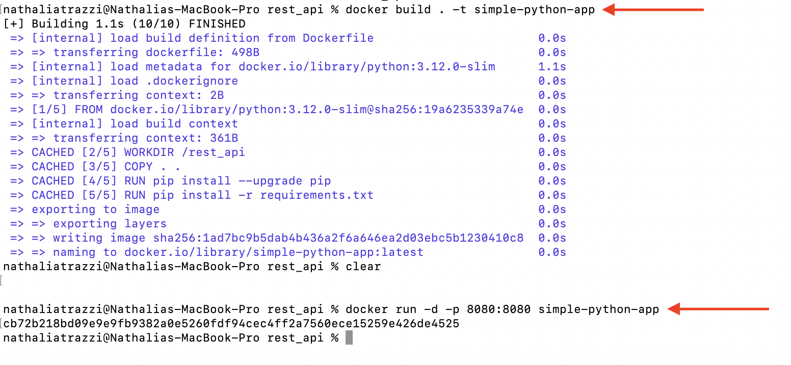

# Simple Python App

This simple application just calculates the sum of two numbers through the value of two numbers sent in a request by the user. 
 
The purpose is to use this application as an example of teaching how to create custom extensions on IBM's **Watsonx Assistant**.

## Article available with instructions for use this Application with Watsonx Assistant 

[https://medium.com/@nathalia.trazzi/getting-started-with-watsonx-assistant-iv-3c7aadb9e598](https://medium.com/@nathalia.trazzi/getting-started-with-watsonx-assistant-ii-b434486470bd)

## Running the application


To make a request to this application, simply pass the following request (in JSON format)

```
{
	"number1": 10,
	"number2": 20
}

```

#### Using locally 

Open your terminal and type the following command:

`git clone https://github.com/miucciaknows/Simple-Python-App.git`

Open your terminal/favorite idle and install the libraries used in this project

-> But first make sure you are in the correct directory path.

`cd sum/source/rest_api`

And then:

`pip3 install requirements.txt`

or, depending on the version of Python used on your machine.

`pip install requirements`

Now, you can run the code with:

`python3 main.py`

or, depending on the version of Python used on your machine.

`python main.py`

To make the request, You can use Insomia or any other software of your choice.


### Using through Docker

To use Docker, you need to have Docker desktop on your machine.
-> For more information about Docker, you can refer to the links below:
- Official Docker documentation (https://docs.docker.com)

Open your terminal and navigate to the correct directory path.

`cd sum/source/rest_api`

And then:

`docker build . -t simple-python-app`

With this command, a build an image was construed in its current folder and using the tag **simple-python-app**

To test your application, run the following command.

`docker run -d -p 8080:8080 simple-python-app`

******************************************************************************************************************************
-d command runs the container in decoupled mode (-d), without blocking your terminal.

-p command specifies the ports to be used in the 8080 application on the internal and external port of the container.

******************************************************************************************************************************



Now your application should be available on port 8080 on your localhost.


Use http://localhost:8080 with the **sum** route to perform the sum operation: **http://localhost:8080/sum**

And then use Insomia or any other software of your choice to send the request and see the results


